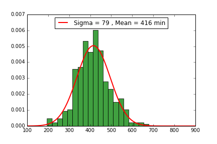
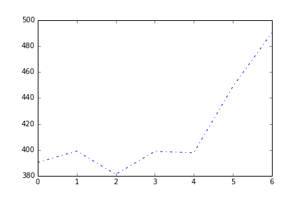
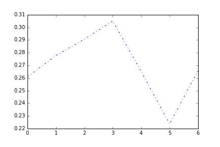
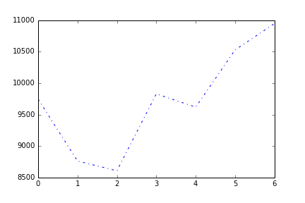

# Изучаем данные Xiaomi Mi Band собранные за год

## Введение

Люди носят фитнес браслеты по разным причинам, я могу предположить некоторые из них:

 1. Для того, чтобы поддерживать себя в форме и выполнять цели по активности
 2. Некая модная штучка
 3. Ставят над собой эксперименты или хотят узнать себя лучше.
 
Я ношу фитнес браслет по причине 3).

В этой заметке я хочу рассказать как можно извлечь данные из браслета и попробовать получить некоторые зависимости.

Методы для извлечения этих данных работают для **Mi Band 1**, **1S**, и, возможно **2** (приложение для 2 кажется такое же)

## Извлечение данных

Для извлечения данных с браслета в первую очередь надо достать с телефона SQLite базу данных в которых хранятся собираемые метрики.
В случае Android'a делается это предельно просто [см. топик на форуме xda-developers](http://forum.xda-developers.com/general/accessories/xiaomi-mi-band-data-extraction-t3019156), [скрипты под актуальную базу](https://github.com/vologab/miband_analytics):
  1. Подключаем Android телефон с включенным режимом отладки по USB к компьютеру.
  2. Делаем бэкап приложения `adb backup -f mi.ab -noapk -noshared com.xiaomi.hm.health`
  3. Создаем `dd if=mi.ab bs=1 skip=24 | python -c "import zlib,sys;sys.stdout.write(zlib.decompress(sys.stdin.read()))" > mi.tar`
  4. Распаковываем архив с БД: `tar xvf mi.tar apps/com.xiaomi.hm.health/db/  2>&1 | tee -a log`
  5. Копируем БД: `cp -f apps/com.xiaomi.hm.health/db/origin_db* ./db/`
  
Как результат, мы получаем SQLite базу данных с именем файла `db/origin_db_[0-9]+$` в которой хранятся метрики Mi Band.

## Загрузка и анализ данных

Для изучения данных на мой взгляд удобно использовать IPython notebook.
[Xiaomi_Mifit_miband_data.ipynb](https://github.com/vologab/miband_jupyter_notebook/blob/master/Xiaomi_Mifit_miband_data.ipynb)

Метрики хранятся в таблице DATE_DATA:

```python
df = pd.read_sql_query("SELECT * from DATE_DATA", con)
```

Колонки в таблице которые представляют интерес:

|колонка|описание|
|--:|-:-|
|DATE|дата|
|SUMMARY|JSON с обработанными данными за день|
|DATA|сырые поминутные данные за сон[активность1], активность2, активность3|
|DATA_HR|сырые поминутные данные пульса|

### Агрегированные за день данные

Агрегированные данные хранятся в виде JSON 

```JSON
{"slp":{"usrEd":-1440,"lt":457,"st":1464376080,"wk":15,"dp":30,"usrSt":-1440,"ed":1464406200},"v":5,"goal":8000,"stp":{"rn":2,"cal":257,"runDist":256,"wk":69,"ttl":5244,"runCal":13,"dis":3817}}
```

Данные делятся на 2 части сон - **slp** и активность **stp**.  Для сна хранится время начала и окончания - **st, ed**, а также время глубокого и легкого сна в минутах - **lt, dp**. Также хранится время просыпания между межды началом и окончанием сна - **wk**. Для активности хранится суммарное количество "шагов" **ttl** - сумма показаний первичного датчика за день, и другие производные величины `func(ttl, рост, вес)`.

### Сырые данные активности и пульса

Сырые данные активности сохраняются каждую минуту (за сутки 1440), и представляют из себя 3 значения за кажду минуту. Первое значение  - сон и значение от 0 до 127 (но в моем случае максимум 126), второе и третье активность 0 - 255 (у меня максимум activity2 - 189, activity3 - 240).

Пульс сохраняется каждую минуту и значения от 0 до 255.

## Как сырые данные превращаются в агрегированные за день

Самый простой агрегат - это количество шагов за день - сумма значений activity3 за день.
Со сном сложнее, я так и не научился сырые данные сна превращать в агрегированные. На форумах, высказывалась мысль что значение activity1 == 4 глубокий сон, а 5 - легкий, но также просто как с шагами установить взаимосвязь между агрегированными данными и сырыми не получается.


## Анализ данных

Во первых сколько я спал в течение года. Это значение оказалось ~ (7 +- 1) час. Кажется с этим все ок.  



Другая очевидная вещь, что высыпаюсь я по выходным:



А если назвать отношение глубокого сна к легкому - качеством, то выяснится, что лучшее качество сна у меня в четверг, и при этом глубой сон - 23% от всего сна.
А в пятницу самое плохое качество сна, боюсь даже предположить почему.



А максимальное количество "шагов" я совершаю в пятницу и субботу:



При этом среда у меня день когда я мало сплю и мало хожу, очевидных объяснений из разряда "я работаю из дома", нет,
поэтому это, что-то новое для меня.

Надеюсь, что кто-нибудь из обладателей популярных браслетов Mi band тоже захочет поизучать себя,
и расскажет о своих особенностях.


 

